# Informe Técnico: Práctica 1 - Máquina Virtual con Linux Mint (VMware + Windows)

**Curso:** Laboratorio Sistemas Operativos 2  
**Nombre:** Andrea Alejandra Pérez Sandoval  
**Carné:** 202201136  
**Sistema Host:** Windows 10  
**Virtualizador:** VMware Workstation Pro v17  
**ISO utilizada:** Linux Mint Xfce 64-bit

---

## Tabla de contenido
- [Informe Técnico: Práctica 1 - Máquina Virtual con Linux Mint (VMware + Windows)](#informe-técnico-práctica-1---máquina-virtual-con-linux-mint-vmware--windows)
  - [Tabla de contenido](#tabla-de-contenido)
  - [Resumen](#resumen)
  - [Objetivos](#objetivos)
  - [Requisitos y herramientas](#requisitos-y-herramientas)
    - [Hardware / host](#hardware--host)
    - [Software](#software)
  - [Procedimiento](#procedimiento)
    - [4.1 Descargas](#41-descargas)
      - [4.1.1 Descarga VMware](#411-descarga-vmware)
      - [4.1.2 Descarga Linux Mint](#412-descarga-linux-mint)
    - [4.2 Instalación de VMware en Windows](#42-instalación-de-vmware-en-windows)
    - [4.3 Creación y configuración de la VM](#43-creación-y-configuración-de-la-vm)
  - [**Evidencia:**](#evidencia)
    - [4.4 Instalación de Linux Mint](#44-instalación-de-linux-mint)
  - [**Evidencia:**](#evidencia-1)

---

## Resumen
En esta práctica se configuró una máquina virtual en VMware sobre Windows, instalando Linux Mint desde una imagen ISO oficial. Se asignaron recursos específicos (RAM, CPU y disco), se configuró la red en modo NAT o Bridge, se verificó conectividad y se creó al menos un usuario sin privilegios de administración. Finalmente se validó la versión del kernel con `uname -r` y se documentaron evidencias.

---

## Objetivos
- Instalar y configurar un virtualizador (VMware) en Windows.
- Crear una VM e instalar Linux Mint desde ISO.
- Configurar recursos de la VM (RAM/CPU/Disco) según requerimiento.
- Configurar red (NAT o Bridge) y comprobar acceso a internet.
- Crear un usuario **no administrador** con permisos limitados.
- Verificar el kernel instalado con el comando `uname -r`.
- Documentar el proceso con capturas y comandos.

---

## Requisitos y herramientas
### Hardware / host
- CPU con virtualización activada (Intel VT-x / AMD-V).
- RAM disponible: mínimo 4 GB (recomendado 8 GB o más).
- Espacio libre en disco: mínimo 25 GB.

### Software
- Windows 10/11.
- VMware Workstation Pro versión 17.
- ISO de Linux Mint versión 22..

---

## Procedimiento

### 4.1 Descargas
#### 4.1.1 Descarga VMware
1. Descargar VMware desde el sitio oficial: https://www.vmware.com/products/workstation-pro/workstation-pro-evaluation.html
2. Crear una cuenta en Broadcom para ingresar al sitio y descargar versiones más recientes: https://profile.broadcom.com/web/registration
3. Dentro de tu dashboard ir a My Downloads, click en HERE 
4. Buscar la opción VMware Workstation Pro.
5. Seleccionar el producto para el sistema operativo de la maquina.
6. Se desplegarán las versiones disponibles, seleccionar la más reciente y descargar el instalador.
7. En nuestro caso descargamos la versión 17.6.2.
8. Aceptar términos y condiciones para iniciar la descarga.
9. Guardar el archivo en una ubicación accesible.

#### 4.1.2 Descarga Linux Mint
1. Descargar Linux Mint ISO desde el sitio oficial: https://linuxmint.com/download.php
2. Ir a Download, Other version, All Version: https://linuxmint.com/download_all.php
3. Buscar version 22.1 xfce 64 bits y descargar.

**Evidencia:**  
- Descarga de VMware
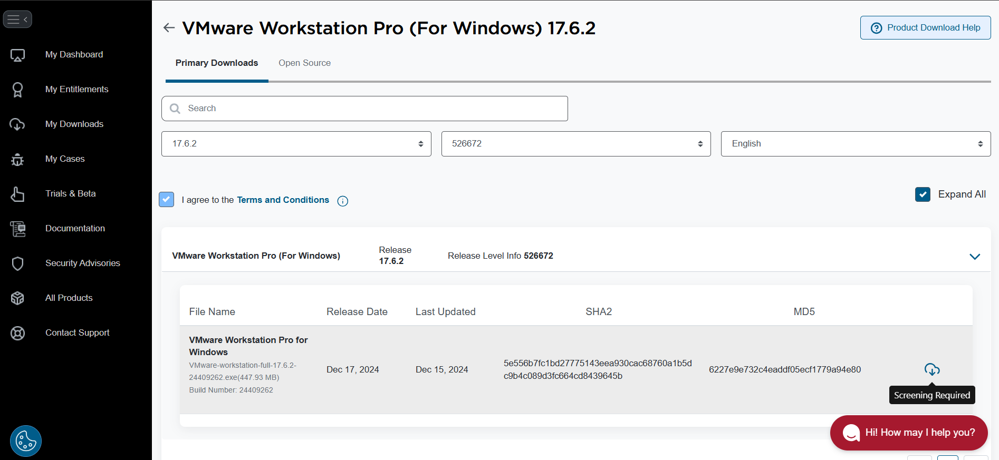 

- Descarga de Linux Mint ISO
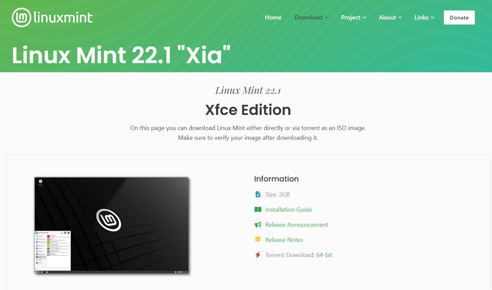

---

### 4.2 Instalación de VMware en Windows
1. Ejecutar el instalador de VMware.
2. Aceptar Terminos y Condiciones.
3. Seleccionar "Next" en cada paso, cambiar configuraciones si se desea.
4. Finalizar y reiniciar si lo solicita.

**Evidencia:**  

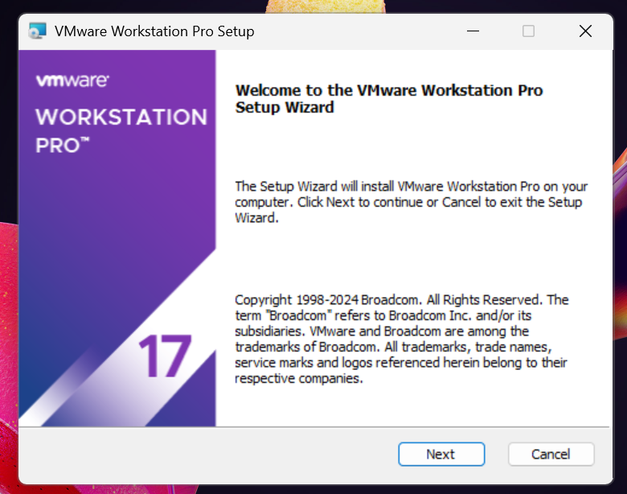

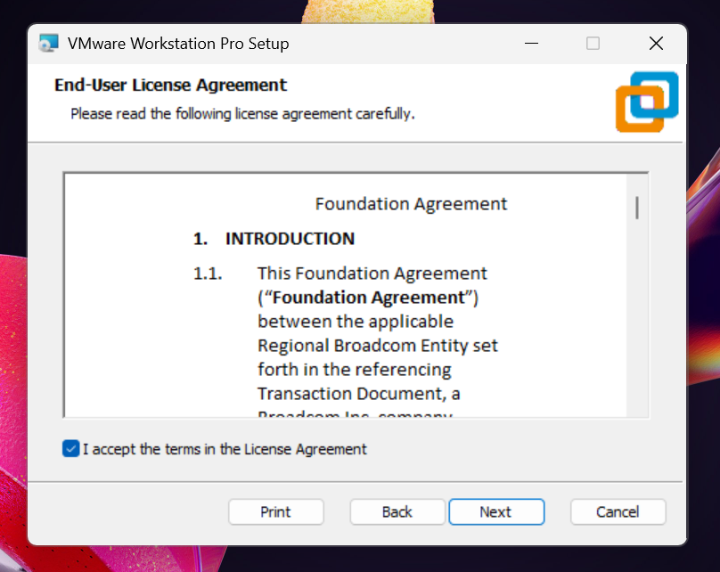

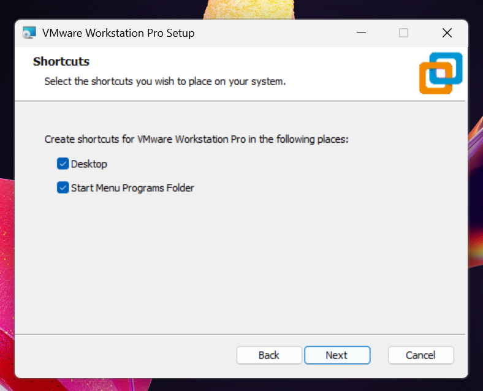

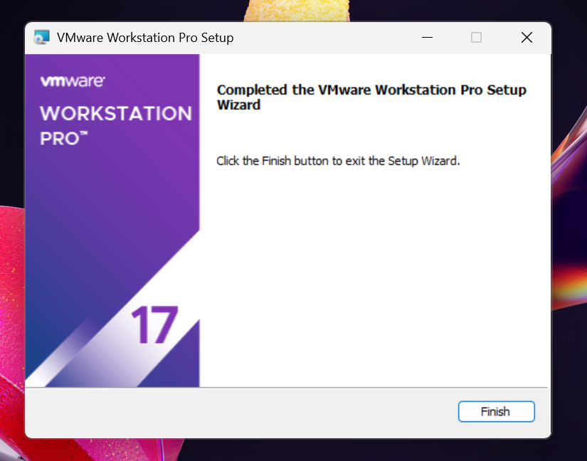

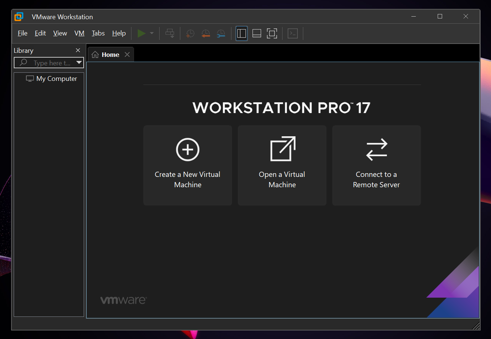

---

### 4.3 Creación y configuración de la VM
1. Abrir VMware.
2. Dentro del espacio de trabajo seleccionar **"Create a New Virtual Machine"**.
3. Se abrirá una pestaña en la cual debemos de seleccionar **"Custom (advanced)"**
4. Dejamos la configuración ya dada por defecto.
5. Al llegar a la opción de la imagen ISO, tendremos que colocar la que anteriormente se descargó.
6. En la configuración del Sitema Operativo debemos de seleccionar Linux y en la versión **"Other Linux 6.x kernel 64 bit"**
7. Colocarle nombre a la maquina virtual.
8. Configurar recursos:
   - **RAM:** 2 GB (2048 MB)
   - **CPU:** 2 núcleos
   - **Disco:** 20 GB
9.  Configurar red:
   - **NAT**
10. Controladores I/O:
   - **LSI Logic**
11. Tipo de Disco:
   - **SCSI**
12. Confirmar y crear la VM.

**Evidencia:**  
- 
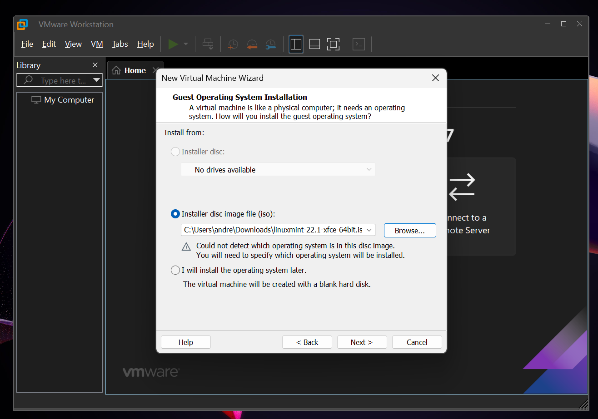  

- 
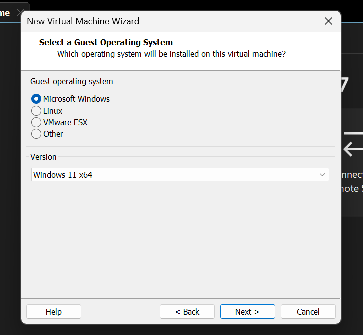  

- 
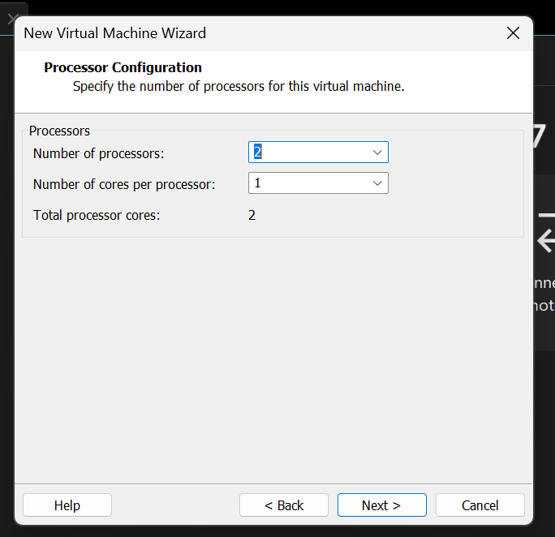

- 
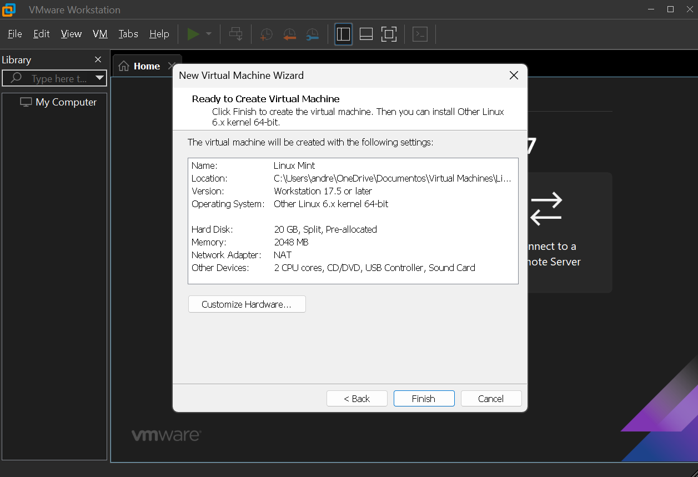

---

### 4.4 Instalación de Linux Mint
1. Iniciar la VM y esperar que cargue el instalador.
2. Elegir idioma, teclado y opciones de instalación.
3. Tipo de instalación: **Erase disk and install Linux Mint** (solo afecta el disco virtual).
4.  Crear usuario principal durante la instalación:
   - Usuario: __________
5.  Reiniciar y retirar ISO si VMware lo solicita.

**Evidencia:**  
- 
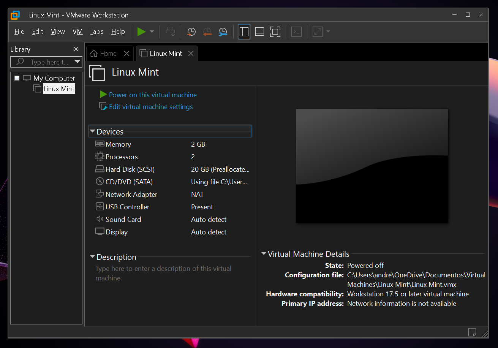  

- 
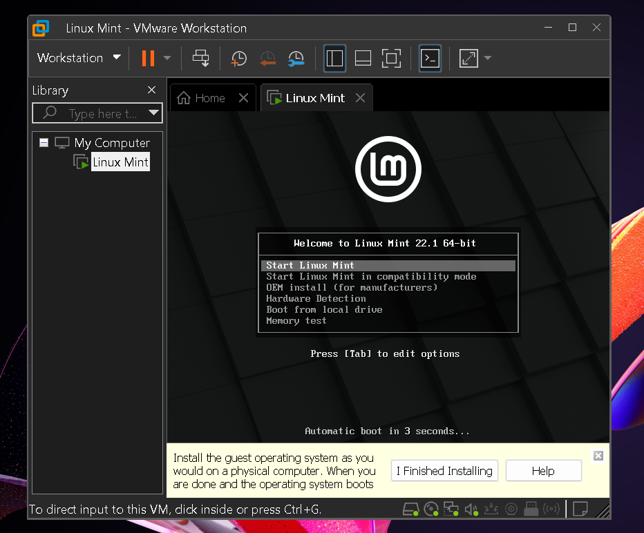  

- 
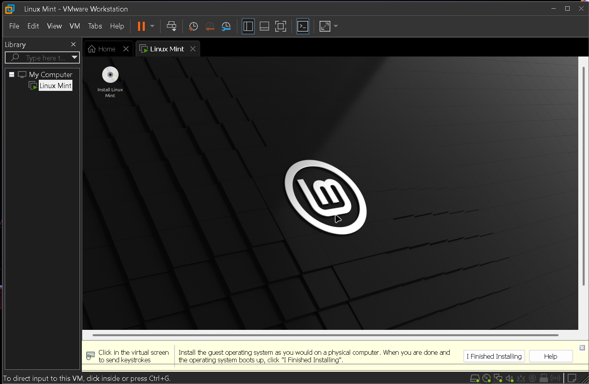  

- 
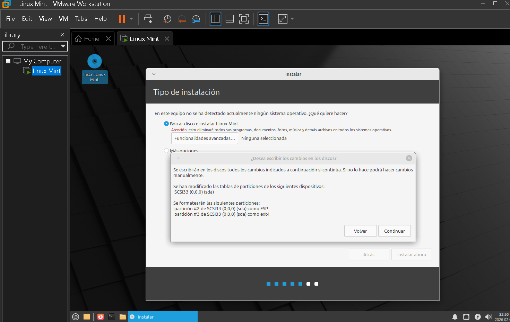 
 
- 
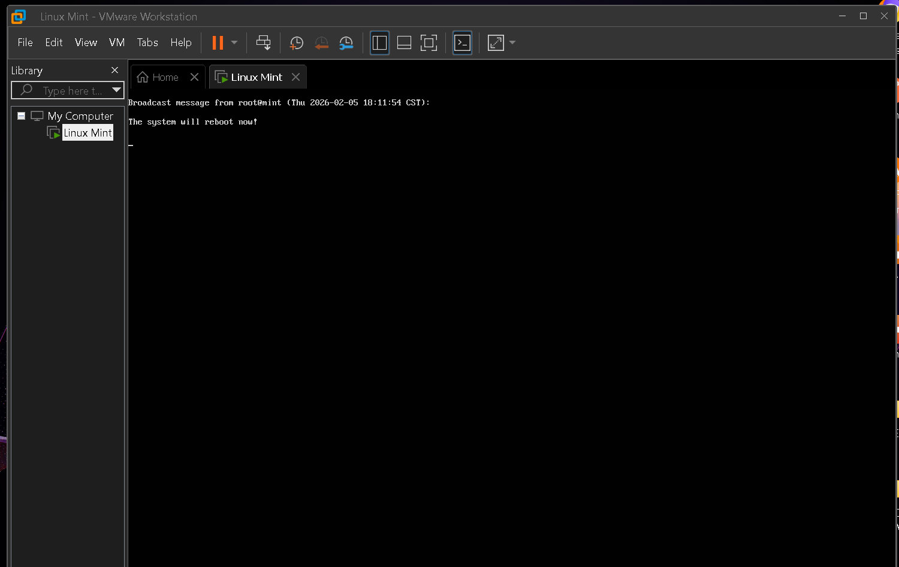 
 
- Escritorio Linux Mint

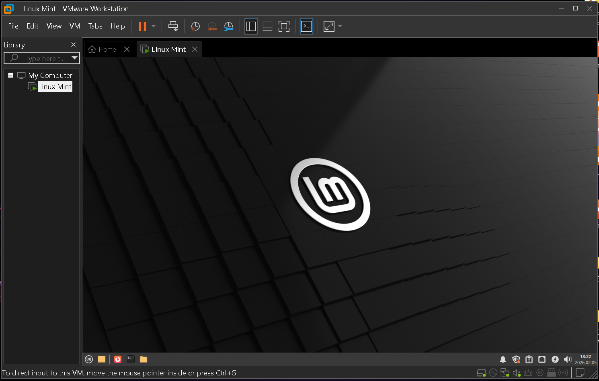  
